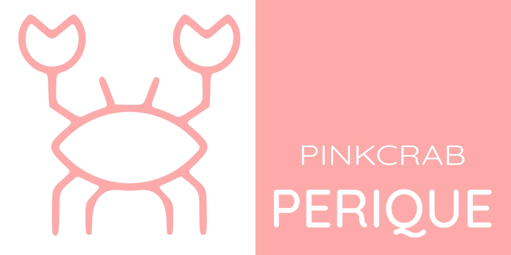

# PinkCrab **Perique** Plugin Framework #



Welcome to the core package of the PinkCrab **Perique** plugin framework, formally known as just the PinkCrab Plugin Framework. 

[](https://packagist.org/packages/pinkcrab/perique-framework-core)
[](https://packagist.org/packages/pinkcrab/perique-framework-core)
[](https://packagist.org/packages/pinkcrab/perique-framework-core)
[](https://packagist.org/packages/pinkcrab/perique-framework-core)


[![WP5.9 [PHP7.4-8.1] Tests](https://github.com/Pink-Crab/Perique-Framework/actions/workflows/WP_5_9.yaml/badge.svg)](https://github.com/Pink-Crab/Perique-Framework/actions/workflows/WP_5_9.yaml)
[![WP6.0 [PHP7.4-8.1] Tests](https://github.com/Pink-Crab/Perique-Framework/actions/workflows/WP_6_0.yaml/badge.svg)](https://github.com/Pink-Crab/Perique-Framework/actions/workflows/WP_6_0.yaml)
[![WP6.1 [PHP7.4-8.2] Tests](https://github.com/Pink-Crab/Perique-Framework/actions/workflows/WP_6_1.yaml/badge.svg)](https://github.com/Pink-Crab/Perique-Framework/actions/workflows/WP_6_1.yaml)
[![WP6.2 [PHP7.4-8.2] Tests](https://github.com/Pink-Crab/Perique-Framework/actions/workflows/WP_6_2.yaml/badge.svg)](https://github.com/Pink-Crab/Perique-Framework/actions/workflows/WP_6_2.yaml)

[](https://dashboard.stryker-mutator.io/reports/github.com/Pink-Crab/Perique-Framework/master)
[](https://codecov.io/gh/Pink-Crab/Perique-Framework)
[](https://scrutinizer-ci.com/g/Pink-Crab/Perique-Framework/?branch=master)
[](https://codeclimate.com/github/Pink-Crab/Perique-Framework/maintainability)


For more details please visit our docs.
[**https://perique.info**](https://perique.info)

## Why? ##

WordPress is a powerful tool for building a wide range of websites, but due to its age and commitment to backwards compatibility it's often frustration to work with using more modern tools.

Perique allows the creation of plugins, MU libraries for use on more complex websites.

The Core only provides access to the `Hook_Loader`, `Registration`, DI (DICE IOC Container), `App_Config` and basic (native) `PHP_Engine` rendering views.

## What is Perique? ##

Perique is rare form of pipe tobacco produced in the St James Parish of Louisiana. This historic tobacco has been produced in the region for centuries and sees tobaccos taken, packed into a barrels under pressure and left to ferment for over 12 months. The resulting tobacco has a strong and pungent quality, which is used to heavily enhance a tobaccos flavour, nicotine content and aroma with only a small quantity used. This is something we strived to produce in this framework; a small amount of existing code that can be used to enhance any codebase to be big, bold and striking.

## Setup ##

```bash 
$ composer require pinkcrab/perique-framework-core

```

First you will need to create your composer.json and plugin.php file. 

### plugin.php

```php
// @file plugin.php 
<?php
     
/**
 * @wordpress-plugin
 * Plugin Name:     My Custom Plugin
 * Plugin URI:      https://my-custom-plugin.com
 * Description:     This is an example plugin for the PinkCrab Perique Framework
 * Version:         1.2.0
 * Author:          Me<me@me.com>
 * Author URI:      https://my-custom-plugin.com
 * License:         GPL-2.0+
 * License URI:     http://www.gnu.org/licenses/gpl-2.0.txt
 * Text Domain:     custom-plugin
 */

require_once __DIR__ . '/vendor/autoload.php';

// Creates an instance of the App_Factory with the current directory as the base path.
$factory = new PinkCrab\Perique\Application\App_Factory(__DIR__);

// Define the default rules. 
$factory->default_setup();

// Set rules and configure DI Container
$factory->di_rules(include __DIR__ . '/config/dependencies.php');

// Pass settings for App_Config
$factory->app_config( include __DIR__ . '/config/settings.php' )

// Pass all class names which should be used during registration
$factory->registration_classes(include __DIR__ . '/config/registration.php' );

// Add optional modules.
$factory->module(Some_Module::class);

// Then just boot the application.
$factory->boot();

```
> Previously (pre 1.4.0) `with_wp_dice()` was used to create the App, this is now deprecated, but will remain for a while to account for any legacy code. The main different between `with_wp_dice()` and `default_setup()` is originally a bug existed where view paths by default where the same as the base path, now this is fixed and the default view path is set to the base path + `/views`. (Applies to all versions 1.4 and above)

### Custom View Path
If you wish to use a custom view path, you can can call `$app_factory->set_base_view_path('path/to/views')` before calling `default_setup()`.

You can also define a DI rule which will allow you to set the base path directly to the `PHP_Engine` class.

> Please note by doing this, it will the use `APP_Config::path('views')` or `APP_Config::url('views')` will not match the path you have set.

```php
return array(
   PHP_Engine::class => array(
      'constructParams' => array( 'custom/view/path' ),
   ),
);
```

## Config files ##

While you can pass arrays to the container_config(), app_config() and registration_classes(), these can get quite large. It can help return them from files.

> These files can be placed anywhere, but in the above example and our boilerplate's, these 3 files are placed in the /config directory.

### dependencies.php

Used to define all of your custom rules for Dice, for more details on how to work with Interfaces and other classes which cant be autowired, see the [Perique Docs::Setup](https://perique.info/core/App/setup)

> Using the full class name is essential, so ensure you include all needed use statements.


```php
// @file config/dependencies.php
use Some\Namespace\{Some_Interface, Some_Implementation};

return array(
   // Your custom rules
   Some_Interface::class => array(
      'instanceOf' => Some_Implementation::class
   )
);
```

### registration.php

When the app is booted, all classes which have either hook calls or needed to be called, are passed in this array. 

By default the Hookable middleware is passed, so all classes which implement the Hookable interface will be called. Adding custom Registration Middleware will allow you to pass them in this array for initialisation at boot.

> Using the full class name is essential, so ensure you include all needed use statements.

```php
// @file config/registration.php
use Some\Namespace\Some_Controller;

return array(
   Some_Controller::class
);
```
See the [Perique Docs::Registration](https://perique.info/core/Registration/) for more details.

### settings.php

The App holds an internal config class, this can be used as an injectable collection of helper methods in place of defining lots of constants.

Alongside the usual path and url values that are needed frequently. You can also set namespaces (rest, cache), post types (meta and slug), taxonomies (slug & term meta), database table names and custom values. 
`

```php
// @file config/settings.php
    
// Assumes the base directory of the plugin, is 1 level up.
$base_path  = \dirname( __DIR__, 1 );
$plugin_dir = \basename( $base_path );

return array(
   'plugin'     => array(
      'version' => '1.2.5',
   ),
   'path'       => array(
      'assets'         => $base_path . '/custom/assets',
   ),
   'url'        => array(
      'assets'         => plugins_url( $plugin_dir ) . '/custom/assets',
   ),
   'db_table' => array(
      'subscriptions' => 'some_plugin_subscribers'
   ),
   'additional' => array(
      // Custom values go here 
      'key' => 'value'   // Config::additional('key'); = value
      'other' => 'value' // $app_config->other = value
   ),
);
```

> The full set of options can be found in the [Perique Docs::App_Config](https://perique.info/core/App/app_config).

## Modules and the Registration Service ##

At the heart of the application is the registration process. Classes can be stacked up and executed at initialisation. This allows for registering into core WP APIs, triggering remote API calls and anything else which needs to be set up when all of WP core is loaded.

### Modules

It is possible to extend Perique with the use of `Modules`. Modules are a way to add additional functionality to Perique and often come bundled with their own Registration Middleware.

Modules are easily added to the App_Factory by calling `$factory->module(Some_Module::class)` and often come with there own config and abstract classes to help with the registration process.

> Please see the [Perique Docs::Modules](https://perique.info/core/Registration/Modules) for more details about how to create your own modules and also a [curated list of existing modules](https://perique.info/module/).

### Hookable

> The `Loader::class` loader has been deprecated and replaced with the new `Hook_Loader::class`

Included with Perique is a single piece of Registration_Middleware. The `Hookable` interface and `Hookable_Middleware` pair make it easy to register any hooks, shortcodes, post types, taxonomies, admin pages, and rest endpoints. Any class which needs to be processed, implements the `Hookable` interface and creates the ```function register(Hook_Hook_Loader $loader): void {...}

```php
class Some_Controller implements Hookable {
   public function register(Hook_Loader $loader): void{
      $loader->admin_action('some_action', [$this, 'some_callback']);
   }
   public function some_callback($some_arg): void {...}
}
```

Now when the init hook is called (priority 1), the some_action hook will be added. So long as the request comes from wp-admin. 

Please see the [Perique Docs::Hookable](https://perique.info/core/Registration/Hookable) for more details.

## DI Container

At its heart, most of Perique makes use a custom version of the [Dice](https://r.je/dice.html) DI container. This allows for the easy creation of classes and the injection of dependencies.

```php 
class With_Dependencies{
   private Some_Repository $repo;
   private Some_Service $service;
   private View $view;

   public function __construct(Some_Repository $repo, Some_Service $service, View $view){
      $this->repo = $repo;
      $this->service = $service;
      $this->view = $view;
   }
}
```
`Some_Repository` and `Some_Service` can be either concrete classes, interfaces or abstract classes. The container will resolve the correct implementation and inject it into the class. For interfaces and abstract classes, you will need to define a rule in the `dependencies.php` config file.

Please see the [Perique Docs::Dependency Injection](https://perique.info/core/DI) for more details.

## View

Out of the box Perique comes with a basic PHP view engine. This allows for the rendering of templates, partials, Components and other view related tasks.

The `View` class can be injected into classes as a dependency, or accessed statically from the `App` object.
```php
// As a dependency
class Something{
   protected View $view;

   public function __construct(View $view){
      $this->view = $view;
   }

   public function render(): void{
      $this->view->render('some/template', ['some' => 'data']);
   }
}

// As a static call
class Something{
   public function render(): void{
      App::view()->render('some/template', ['some' => 'data']);
   }
}
```

All template paths are relative to the `view_path` defined when creating the app. Also the `.php` extension is not required and optionally you can use the `.` or `/` to separate the path.

| Template Path | View Path | Full Path |
| --- | --- | --- |
| `some/template` | `/path/to/views` | `/path/to/views/some/template.php` |
| `some/template.php` | `/path/to/views/` | `/path/to/views/some/template.php` |
| `some.template` | `/path/to/views` | `/path/to/views/some/template.php` |
| `some.template.php` | `/path/to/views/` | `/path/to/views/some/template.php` |

Please visit the [Perique Docs::View](https://perique.info/core/App/view) for more details.

## Static Helpers ##

The App object has a few helper methods which can be called statically (either from an instance or from its name). 

### App::make(string $class, array $args = array()): object

* @param string $class Fully namespaced class name
* @param array<string, mixed> $args Constructor params if needed
* @return object Object instance
* @throws App_Initialization_Exception Code 4 If app isn't initialised.

 `make()` can be used to access the DI Container to fully resolve the dependencies of an object. 

```php 
$emailer = App::make(Customer_Emailer::class); 
$emailer->mail(ADMIN_EMAIL, 'Some Report', $email_body); 
$emailer->send(); 

```

### App::config(string $key, ...$child): mixed

* @param string $key The config key to call
* @param ...string $child Additional params passed.
* @return mixed
* @throws App_Initialization_Exception Code 4 If app isn't initialised.

Once the app has been booted you can access the App_Config values by either passing App_Config as a dependency or by using the Apps helper.

```php

// Get post type slug
$args = ['post_type' => App::config('post_types', 'my_cpt')];

// Get current plugin version.
$version = App::config('version');
```

> For more details on App_Config and its various use cases, [please checkout the full docs](https://app.gitbook.com/@glynn-quelch/s/pinkcrab/application/app_config).

### App::view(): View

* @return View
* @throws App_Initialization_Exception Code 4

If you need to render or return a template, you can use the `view()` helper. Returns an instance of the View class, populated with the current defined engine (use PHP by default).

```php
App::view()->render('signup/form', ['user' => wp_get_current_user(), 'nonce' => $nonce]);
```


It is possible to use dot notation in all view file paths. This allows for a simple way of defining paths for use on either Win or Unix file systems.

```php
$view->render('path.to.file',['var' => 'foo']);
```
Would equate to 
```php
$view->render('path/to/file',['var' => 'foo']);
```

## Hooks ##

We have a number of hooks you can use to extend or modify how the app works. All of our internal hooks have pinkcrab/pf/app/ prefix, but we have a class of constants you can use `PinkCrab\Perique\Application\Hooks:: APP_INIT_*`

* `Hooks:: APP_INIT_PRE_BOOT`
* `Hooks:: APP_INIT_PRE_REGISTRATION`
* `Hooks:: APP_INIT_POST_REGISTRATION`
* `Hooks:: APP_INIT_CONFIG_VALUES`
* `Hooks:: APP_INIT_REGISTRATION_CLASS_LIST`
* `Hooks:: APP_INIT_SET_DI_RULES`
* `Hooks::COMPONENT_ALIASES`
* `Hooks::MODULE_MANAGER`

Please see the [Perique Docs::Hooks](https://perique.info/core/App/hooks) for more details.

## License ##

### MIT License

http://www.opensource.org/licenses/mit-license.html  

## Change Log ##

* 2.0.0 -
   * Dropping of support for PHP 7.2 & 7.3 
   * Creation of Modules and the removal of adding `Registration_Middleware` to the App at setup.
   * Custom DICE instance to allow the use of `call` rules with multiple Interfaces
   * Restriction of setting base and view paths in App_Config
   * Addition of `wbdb_prefix` to App_Config 
   * Lots of internal bug fixes and improvements.
   * More strict typing and return types.
   * More strict testing thanks to infection (Mutation Testing)
* 1.4.0 - 
   * Added `set_base_view_path()` and `get_base_view_path()` to App_Factory
   * Changed how the base view path is used during App_Factory, it will now default to base path (passed when creating the factory) + '/views'
   * Added `get_base_path()` to App_Factory, this gets the base path for the plugin.
   * Fixed bug where defaults App_Config paths were not being set correctly, now are based on the base path used when creating App_Factory. 
   * Added `base_view_path()` to Renderable and PHP_Engine instances.
   * Fixed bug in Component_Compiler where paths from classname added 2 dashes per underscore.
   * Cleaned up various internal objects, replacing many protected properties with private and making final.
   * Expanded testing to cover Infection (Mutation Testing), this has seen the tests become more robust.
* 1.3.1 - Added more meaningful errors for App_Config, updated dependencies and removed unused function in PHP_Engine
* 1.3.0 - Dropped testing for WP5.8 and introduced WP6.1 testing
* 1.2.3 - Allow dot notation in view paths.
* 1.2.2 - Fixes bug where component paths were not independent of the base view path.
* 1.2.1 - Added filter to allow for custom component path aliases.
* 1.2.0 - Added Component and View Model support to View and Renderable Interface
* 1.1.2 - Update all dependencies for WP6.0
* 1.1.1 - Improved default paths/urls
* 1.1.0 - Allows the settings of a base path for plugin. Used for fallback app config path/urls and for default `PHP_Engine` template root paths. 
* 1.0.8 - Fixed incorrect interface used for Inject_App_Config in default DI rules added when App is initialised. Dev Dependencies updated to use current PinkCrab defaults. Removed .vscode config files from repo
* 1.0.7 - WPDB is now defined in the DI rules when the app is finailised (via `$app->boot()` method). Before it was only loaded if created using the App_Factory and not available before `init` is called.
* 1.0.6 - Added interfaces for injecting DI_Container, Hook_Loader and App_Config via a method with the help of an interface.
* 1.0.5 - When exporting the App_Config data, the array of meta data keys is now exported correctly. Also removed a declaration in View that was not needed.
* 1.0.4 - Added fallback values to url(), path(), additional() and namespaces() in App_Config() 
* 1.0.3 - DI Container and Hook Loader are now auto populated to Middleware if the ```public function set_hook_loader(Hook_Loader $loader):void{}``` and ```public function set_di_container(DI_Container $container):void{}``` methods are defined in the Middleware class.
* 1.0.2 - Ensure that middleware class names are only constructed during finalise when all internal DI rules are defined (esc DI Container instance.)
* 1.0.1 - Allow all middleware to be passed as classname and then constructed via the container, as well as allowing fully instantiated classes to be passed.
* 1.0.0 - Renamed Registerable interface to Hookable, including the internal Registerable_Middleware to Hookable_Middleware. Corrected typos, App::registration_classes() now App::registration_classes(), App_Initialization_Exception::registration_exists() to App_Initialization_Exception::registration_exists().
* 0.5.6 - Ensure App_Config is not populated as its DI ruleset as part of App->boot(). This ensures Config Facade is populated with the pass App_Config config array.
* 0.5.5 - Allows passing of registration middleware via App_Factory setup chain. Also allows the passing of DI_Container as a dependency via DI_Container. Allowing for modules to access DI without having to pass App and then use App::make(). 
* 0.5.4 - Moved to new repo to allow renaming via Packagist
* 0.5.3 - Move to new composer name due to issue with existing.
* 0.5.2 - Updated the primary namespace from PinkCrab\Perique to PinkCrab\Perique. Corrected typo on package name in composer.json, from perqiue to perique.
* 0.5.1 - Removed last Loader::class type hints and references. All now working with Hook_Loader::class
* 0.5.0  
  + Moved to the new Hook_Loader type. 
  + Updates to App_Config (creation of meta sub section and move to simple key/value pairs for post type and taxonomies).
  + Added setup() and tear_down() methods to the Registration_Middleware interface. 
  + Moved Collection into its [own repository](https://github.com/Pink-Crab/Collection). 
  + Removed unused service container interface.
* 0.4.1 - Updated tests to reflect the new Hook_Loader's internal structure (accessing protected state for tests)
* 0.4.0 - Introduced new app, with app factory to help with cleaner initialisation. Reintroduced Registration_Middleware which was removed in 0.2.0. Moved the registerables into a default piece of middleware which is automatically added at boot. Added a series of actions around the init callback which runs the registration process.
* 0.3.9 - Moved Loader into its own library, all tests and use statements updated.
* 0.3.8 - Added in missing Hook_Removal & Loader tests.
* 0.3.7 - Added in Hook_Removal and made minor changes to the Loader tests.
* 0.3.6 - Added remove_action() and remove_filter() to Loader
* 0.3.5 - Added coverage reports to gitignore
* 0.3.4 - Improved tests and hooked to codecov
* 0.3.3 - Removed object type hint from service container.
* 0.3.2 - Added in tests and expanded view
* 0.3.1 - Minor docblock changes for phpstan lv8
