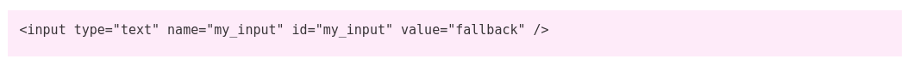

# Form Fields

Simple form field creator with a fluent api, perfect for WordPress hook callbacks and MetaBoxes.

### Installation

To install from composer please run

```bash
composer require pinkcrab/form-fields
```

### Basic Usage

To create a simple form field and render\(print\) it to the screen

```php
Input_Text::create( 'my_input' )
    ->current( get_option( 'my_option', 'fallback' ) )
    ->render();
```


You can return the HTML string of the input using as\__string_\(\)

```php
Input_Text::create( 'my_input' )
    ->current( get_option( 'my_option', 'fallback' ) )
    ->as_string();
```



### Field Types

* [Text](https://glynn-quelch.gitbook.io/pinkcrab/modules/modules/form-fields/input_text)
* Number
* Password
* Email
* Range
* Date
* Date Time
* Checkbox
* Radio
* Select
* Raw HTML
* Hidden
* Text Area

All inputs are extended from the Abstract\_Field class and have all the functionality laid out in the Base Field section.

Labels

### Output

Each form field is preloaded with a parser which can either render the input field or return the HTML. If you create your own field, you can make use of our existing parsers or create your own, using the Parser interface.

```php
Input_Text::create('test')->render()    // Prints the input
Input_Text::create('test')->as_string() // Returns as HTML string.
```

### Field Creation

All of our Form Fields has protected `__construct`'ors and need to be created using the **create\(\)** named constructor.

```php
Input_Text::create('name')->render();
Input_Email::create('email')->render();
Input_Password::create('password')->render();
```


