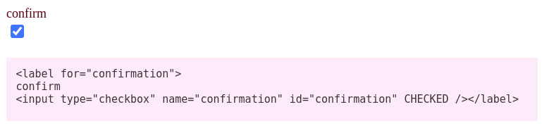
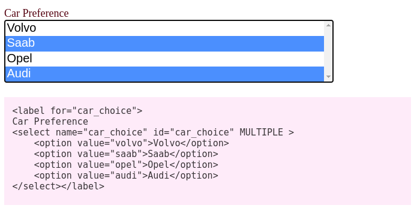
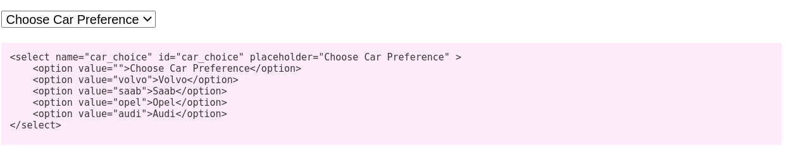
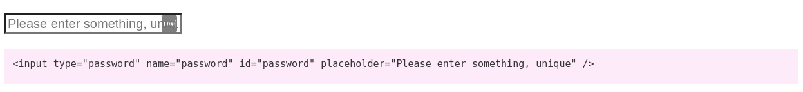

# Additional Attributes

## Autocomplete / Trait

> `namespace PinkCrab\Form_Fields\Traits;  
>   
> trait Autocomplete { ... }`

### autocomplete\(\)

> @param string The autocomplete options, defaults to 'on' if no value passed.  
> @return static

You can set the autocomplete value by passing the string. If no value is passed, on will be used as the default. If you need to override this after it's been set. Use autocomplete\('off'\), it will still render the attribute but should return control back to the browser.

Autocomplete is added to the attributes array, so could be overwritten if **set\_attributes\(\)** is used after setting this.

```php
Text_Input::create('first_name')->autocomplete('given-name')->render();
```


### get\_autocomplete\(\)

> @return string Returns the set value or a blank string if not defined.

## Checked / Trait

> `namespace PinkCrab\Form_Fields\Traits;  
>   
> trait Checked { ... }`

### checked\(\)

> @param bool $checked Sets if the input is checked  
> @retrun static

Used on checkboxes to denote if the input is checked.   
Uses a custom property `protected bool $checked = false;`

```php
Input_Checkbox::create('confirmation')
	->label('confirm')
	->show_label()
	->checked(/*do_something()*/)
	->render();
```



### is\_checked\(\)

> @return bool Is the input checked.

## Multiple / Trait

> `namespace PinkCrab\Form_Fields\Traits;  
>   
> trait Multiple { ... }`

### multiple\(\)

> @param bool $multiple Does this input allow multiple inputs  
> @retrun static

Select, Email and the File inputs all allow the use of multiple inputs.   
Adds a custom property to any class which uses the Multiple trait. `protected bool $multiple = false;`

```php
Select::create('car_choice')
	->label('Car Preference')
	->show_label()
	->multiple()
	->options([
		'volvo' => 'Volvo',
		'saab' 	=> 'Saab',
		'opel'  => 'Opel',
		'audi'  => 'Audi'
	])
	->render();
```



### is\_multiple\(\)

> @return bool Is the input set to include multiple flag.

## Placeholder / Trait

> `namespace PinkCrab\Form_Fields\Traits;  
>   
> trait Placeholder { ... }`

### placeholder\(\)

> @param string $placeholder Adds a placeholde value.  
> @retrun static

Adds a placeholder to string and text-based inputs, and an initial \(value-less\) option to all select options.  
Makes use of the attributes list, so could be overwritten using **placeholder\(\)** if already declared.  
If no value is passed in placeholder\(\) it will unset the existing value.

```php
Select::create('car_choice')
	->placeholder('Choode Car Preference')
	->options([
		'volvo' => 'Volvo',
		'saab' 	=> 'Saab',
		'opel'  => 'Opel',
		'audi'  => 'Audi'
	])
	->render();
```



```php
Input_Password::create('password')
	->placeholder('Please enter something, unique')
	->render();
```



### placeholder\(\)

> @return mixed Returns the current placeholder value.


