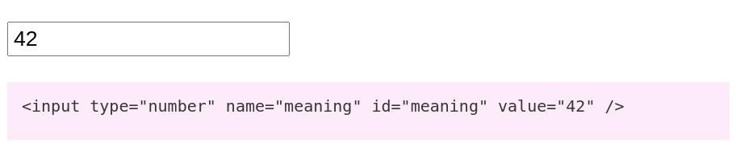
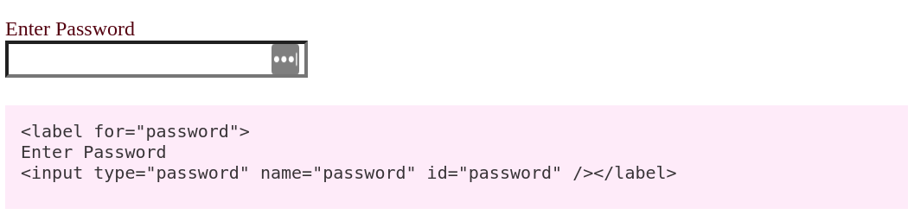
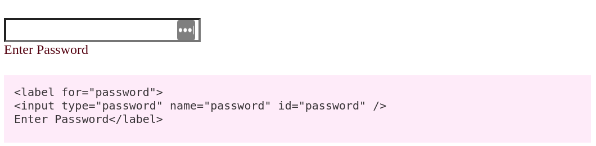
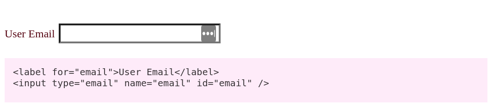
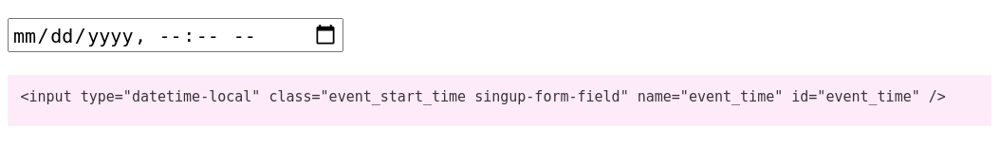
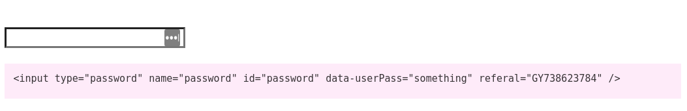
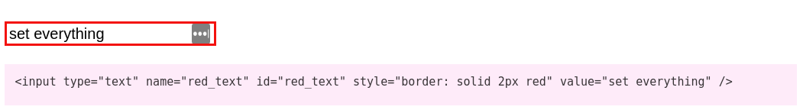

# Base Field

### current\(\)

> @param string\|array\|null $current The current value.  
> @return static

All fields bar select \(in either singular or multiple modes\) will accept a string, int or float values for current. With select requiring an array _\(if a single value is supplied, it will be wrapped in an array by default\)_ 

```php
Input_Numbner::create( 'meaning' )
    ->current( 42 )
    ->render();
```



### disabled\(\)

> @param bool $disabled Is the field disbaled.  
> @return static

By default, the field is NOT disabled, but this can be toggled.  
False can be passed to make a disabled field, not disabled.

```php
Input_Text::create( 'disabled_input' )
    ->disabled()
    ->render(); 
```


### read\_only\(\)

> @param bool $read\_only Is the field read\_only.  
> @return static

By default, the field is NOT read only, but this can be toggled.

```php
Input_Text::create( 'readonly_input' )
    ->readonly()
    ->render();
```


### label\(\)

> @param string $label The fields label.  
> @return static

The label is hidden by default and must be displayed with **show\_label\(\)**. Its position can be set using the **label\_position\(\)** method.

```php
Input_Password::create( 'password' )
    ->label('Enter Password')
    ->show_label()
    ->render();
```



### label\_position\(\)

> @param int $mode Bitwise flag for position and reference to input  
> @return static

The label's position can be set to be before or after the input and you can also set how it is referenced to the input. It can either be linked by id \(displayed together\) or the input can be wrapped in the label.

By default, the label is shown wrapping the input positioned above.

```php
Input_Password::create( 'password' )
    ->label('Enter Password')
    ->show_label()
    ->label_position( Label_Config::AFTER_INPUT )
    ->render();

```



```php
Input_Email::create( 'email' )
    ->label('User Email')
    ->show_label()
    ->label_position( Label_Config::LINKED_LABEL )
    ->render();
```



```php
// Lable Position Constants
use PinkCrab\Form_Fields\Label_Config;

Label_Config::WRAP_LABEL    // Wraps field in label
Label_Config::LINKED_LABEL  // Links with id field
Label_Config::BEFORE_INPUT  // Label before field
Label_Config::AFTER_INPUT   // Label after field
```

### class\(\)

> @param string $class Class list to render with input  
> @return static

If left blank will not render a class attribute in the html field. Multiple values should be entered as with regular html, so single spaces

```php
Input_Date_Time::create( 'event_time' )
    ->class('event_start_time singup-form-field')
    ->render();
```



### attribute\(\)

> @param string $key The attribute key  
> @param string $value The attribute value  
> @return static

Attributes can be added to almost all inputs, this is how we set the placeholder, current value and other attributes.  
Multiple attributes can be entered with multiple call, or using set\_attributes.

```php
Input_Password::create( 'password' )
    ->attribute('data-userPass', 'something')
    ->attribute('referal', 'GY738623784')
    ->render();
```



### set\_attributes\(\)

> @param array&lt;key, value&gt; $attributes Array of attributes   
> @return static

Unlike **attribute\(\)**, **set\_attribute\(\)** will set mutliple attributes in a single call. Care should be taken as this repalces the current attribute value, so could overwrite the current value or other preset values.

```php
Input_Text::create( 'red_text' )
    ->set_attributes([
    'style' => 'border: solid 2px red',
    'value' => 'set everything'])
    ->render();
```



## Getters

All values of the Field object have getters for accessing the protected properties. 

### get\_key\(\)

> @return string The key \(name & id\) defined for the input

### get\_type\(\)

> @return string The current field type \(Object name\)

### get\_label\(\)

> @return string The current set label

### get\_class\(\)

> @return string Any defined classes

### get\_disabled\(\)

> @return bool if disabled will return true.

### get\_current\(\)

> @return mixed Returns whatever is set as the current value, will return null if empty

### get\_attributes\(\)

> @return array&lt;key, value&gt; The current defined attributes.

## Label Config

You can access the underlying **Label\_Config** object by calling `label_config()`. Just remember that if you try to continue a chained call. It will no longer be the Form Field object in the scope of the chain.

### label\_config\(\)

> @return Label\_Config The current label config.


 

