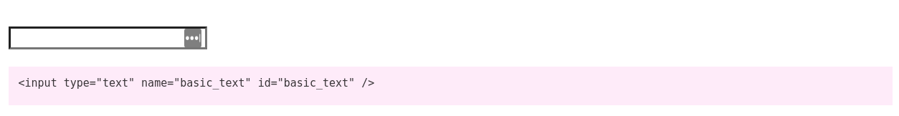
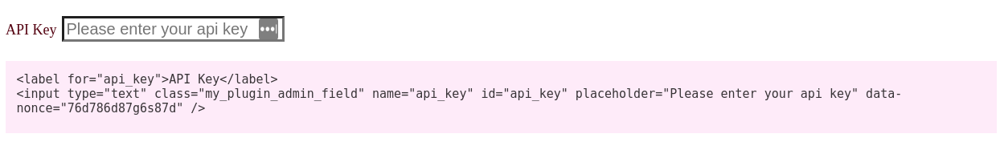

# Input\_Text

```php
namespace PinkCrab\Form_Fields\Fields;

use PinkCrab\Form_Fields\Abstract_Field;
use PinkCrab\Form_Fields\Traits\Placeholder;
use PinkCrab\Form_Fields\Traits\Autocomplete;

class Input_Text extends Abstract_Field {
	use Placeholder, Autocomplete;
}

// Useage
Input_Text::create('input_text')->render();
```

### Attribute Traits

* [Placeholder](https://glynn-quelch.gitbook.io/pinkcrab/modules/modules/form-fields/additional-attributes#placeholder-trait)
* [Autocomplete](https://glynn-quelch.gitbook.io/pinkcrab/modules/modules/form-fields/additional-attributes#autocomplete-trait)

### Methods

* [create\( string $key \)](https://glynn-quelch.gitbook.io/pinkcrab/modules/modules/form-fields#field-creation)
* [current\( mixed $current = null \)](https://glynn-quelch.gitbook.io/pinkcrab/modules/modules/form-fields/base-field#current)
* [disabled\( bool $disabled = true \)](https://glynn-quelch.gitbook.io/pinkcrab/modules/modules/form-fields/base-field#disabled)
* [read\_only\( bool $read\_only = true \)](https://glynn-quelch.gitbook.io/pinkcrab/modules/modules/form-fields/base-field#read_only)
* [label\( string $label \)](https://glynn-quelch.gitbook.io/pinkcrab/modules/modules/form-fields/base-field#label)
* [class\( string $class \)](https://glynn-quelch.gitbook.io/pinkcrab/modules/modules/form-fields/base-field#class)
* [attribute\( string $key, string $value \)](https://glynn-quelch.gitbook.io/pinkcrab/modules/modules/form-fields/base-field#attribute)
* [set\_attributes\( array $attributes \)](https://glynn-quelch.gitbook.io/pinkcrab/modules/modules/form-fields/base-field#set_attributes)
* [show\_label\( bool $show = true \)](https://glynn-quelch.gitbook.io/pinkcrab/modules/modules/form-fields/base-field#label)
* [label\_position\( int $mode = 0 \)](https://glynn-quelch.gitbook.io/pinkcrab/modules/modules/form-fields/base-field#label_position)
* [autocomplete\( string $autocomplete = 'on' \)](https://glynn-quelch.gitbook.io/pinkcrab/modules/modules/form-fields/additional-attributes#autocomplete)
* [placeholder\( string $placeholder = '' \)](https://glynn-quelch.gitbook.io/pinkcrab/modules/modules/form-fields/additional-attributes#placeholder)
* [get\_type\(\)](https://glynn-quelch.gitbook.io/pinkcrab/modules/modules/form-fields/base-field#get_type)
* [get\_label\(\)](https://glynn-quelch.gitbook.io/pinkcrab/modules/modules/form-fields/base-field#get_label)
* [get\_class\(\)](https://glynn-quelch.gitbook.io/pinkcrab/modules/modules/form-fields/base-field#get_class)
* [get\_disabled\(\)](https://glynn-quelch.gitbook.io/pinkcrab/modules/modules/form-fields/base-field#get_disabled)
* [get\_key\(\)](https://glynn-quelch.gitbook.io/pinkcrab/modules/modules/form-fields/additional-attributes#autocomplete-trait)
* [get\_current\(\)](https://glynn-quelch.gitbook.io/pinkcrab/modules/modules/form-fields/base-field#get_current)
* [get\_attributes\(\)](https://glynn-quelch.gitbook.io/pinkcrab/modules/modules/form-fields/base-field#get_attributes)
* [get\_autocomplete\(\)](https://glynn-quelch.gitbook.io/pinkcrab/modules/modules/form-fields/additional-attributes#get_autocomplete)
* [get\_placeholder\(\)](https://glynn-quelch.gitbook.io/pinkcrab/modules/modules/form-fields/additional-attributes#placeholder-1)
* [label\_config\(\)](https://glynn-quelch.gitbook.io/pinkcrab/modules/modules/form-fields/base-field#label_config)
* [render\(\)](https://glynn-quelch.gitbook.io/pinkcrab/modules/modules/form-fields#output)
* [as\_string\(\)](https://glynn-quelch.gitbook.io/pinkcrab/modules/modules/form-fields#output)

### Examples

```php
Input_Text::create( 'basic_text' )->render()
```



```php
Input_Text::create( 'api_key' )
	->label( 'API Key' )
	->placeholder( 'Please enter your api key' )
	->class( 'my_plugin_admin_field' )
	->attribute( 'data-nonce', '76d786d87g6s87d' )
	->show_label()
	->label_position( Label_Config::BEFORE_INPUT | Label_Config::LINKED_LABEL )
	->render();
```



