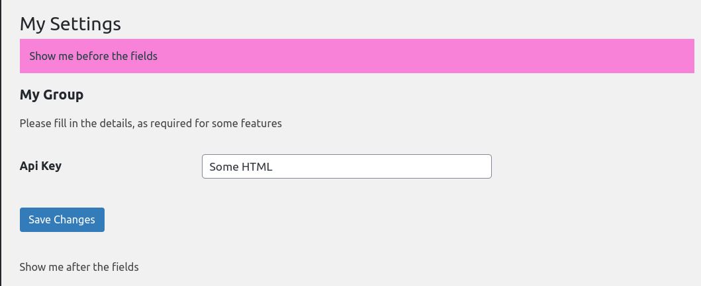
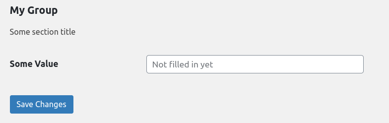

# \(Abstract\) Settings\_Page

> Settings\_Page doesnt make use of a constructor, so you can inject in any needed depenecies and/or use the constructor for defining properties with expressions in your instance.

## Properties

Your custom settings page is partly controlled by defined properties. 

### $key

> @var string  
> @required

Denotes the Settings\_Page's key and its slug. Must be unique and conform to the standard WordPress slug rules.

### $menu\_title

> @var string  
> @required

The title is shown for the Settings sub menu item.

### $page\_title

> @var string  
> @required

The page title is shown on the rendered page.

### $position

> @var int\|null

Sets the position within the submenu, can be omitted to appear at the end of the list \(based on the current pages added, pages added after will appear below\).

### $capability

> @var string \(defualts to 'manage\_options'\)

Sets the required user capabilities to access the page. 

### $before\_fields

> @var string

Add optional HTML before the **Settings\_Groups** are rendered. This allows for adding in the custom header and even making faux tabs \(see examples for more details\)

### $after\_fields

> @var string

Adds in optional HTML after the fields, allows for closing any open tags from **$before\_fields**.

```php
class Rest_Settings extends Settings_Page {

	// Set page values.
	protected $key           = 'my_settings';
	protected $menu_title    = 'My Settings';
	protected $page_title    = 'My Settings';
	protected $before_fields = '<div class="inner"><div style="background: #ff81d8;padding: 12px;color: #174040">Show me before the fields</div>';
	protected $after_fields  = '<p>Show me after the fields</p></div>';
	protected $position      = 1;
	protected $capability    = 'edit_others_posts';
```



## Methods

To add Settings\_Groups, enqueue JS/CSS files and register additional hook calls. There are a selection of methods you can use to populate the page.

### setup\(\)

> @param Loader $loader  
> @return \PinkCrab\Modules\Settings\_Page\Settings\_Page

This method can be used to register additional hook calls. These will be added to the same loader used to register your page, so be aware that the page and its settings are registered on 'admin\_init' & 'admin\_menu'.

```php
protected function setup( Loader $loader ): void{
    $loader->action('admin_init', function(){
        // Do something to refresh cached data.
        refresh_some_transients();
    });
}
```

### enqueue\(\)

> @return \PinkCrab\Modules\Settings\_Page\Settings\_Page

This method is automatically fired on 'admin\_enqueue\_scripts' and only when the page being created is loaded. This allows for custom styling and hooking up ajax calls for select2 and other dynamic fields.

```php
protected function enqueue(): void {
    // Using the Enqueue module, but can be regluar enqueue_script call.
    Enqueue::script('my_setting_ajax')
        ->src('some_file.js')
        ->register();
    
    Enqueue::style('my_setting_styles')
        ->src('some_file.css')
        ->register();    
}
```

### add\_settings\(\)

> @param \PinkCrab\Modules\Settings\_Page\Settings\_Group $settings  
> @return \PinkCrab\Modules\Settings\_Page\Settings\_Page

add\_settings\(\) is used to add as many Settings\_Group objects as needed. These can be written all inline or spread out into multiple methods as required. For more details on creating Settings\_Group's, please [view here](https://app.gitbook.com/@glynn-quelch/s/pinkcrab/~/drafts/-MPuB5HnIJ0vdNuoKqUG/modules/modules/settings-page/settings-group)

```php
protected function add_settings( Settings_Collection $settings ): void{
    $settings->add(
        Settings_Group::create(
            'my_settings',
            'My Group',
            $this->key
        )->description( 'Some section title' )
        ->add_field(
            Settings_Field::from_field(
                Input_Text::create( 'some_value', 'Some Value' )
                    ->placeholder( 'Not filled in yet' )
            )
            ->type( 'string' )
            ->santization_callback( 'sanitize_text_field' )
        )
    );  
}
```



## Additional Information

The Settings\_Page has no arguments in its constructor, so this allows for the injection of dependencies. 

```php
class My_Page extends Setttings_Page {
    
    protected $my_service;
    
    public function __construct(My_Service $my_service){
        // Injected using DICE
        $this->my_service = $my_service;
    }

    protected function enqueue(): void {
        // Gets JS file url from service.
        Enqueue::script('my_setting_script')
        ->src( $this->my_service->get_js_files('settings') )
        ->register();
    }
}
```

