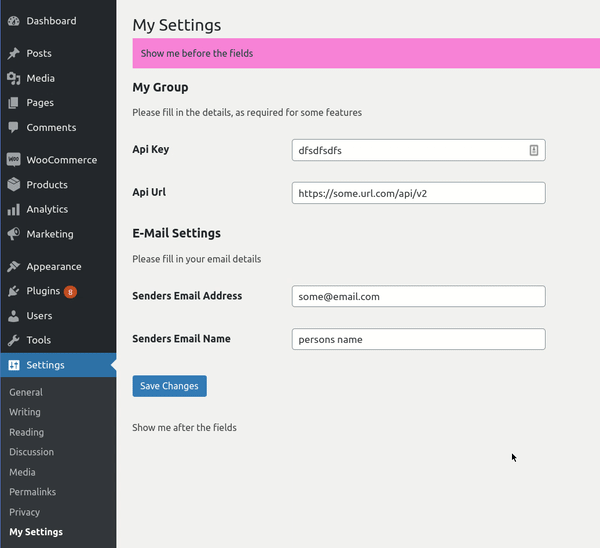

# Examples

### Multiple Groups

```php
<?php

declare(strict_types=1);

namespace PinkCrab\My_Plugin\Settings_Pages;

use PinkCrab\Modules\Settings_Page\Settings_Page;
use PinkCrab\Modules\Settings_Page\Settings_Field;
use PinkCrab\Modules\Settings_Page\Settings_Group;
use PinkCrab\Modules\Form_Fields\Fields\Input_Text;
use PinkCrab\Modules\Form_Fields\Fields\Input_Number;
use PinkCrab\Modules\Settings_Page\Settings_Collection;

class Rest_Settings extends Settings_Page {

	// Set page values.
	protected $key           = 'pc_rest_settings';
	protected $menu_title    = 'My Settings';
	protected $page_title    = 'My Settings';
	protected $before_fields = '<div class="inner"><div style="background: #ff81d8;padding: 12px;color: #174040">Show me before the fields</div>';
	protected $after_fields  = '<p>Show me after the fields</p></div>';

	/**
	 * Allows the adding of settings.
	 *
	 * @param \PinkCrab\Modules\Settings_Page\Settings_Collection $settings
	 * @return void
	 */
	protected function add_settings( Settings_Collection $settings ): void {
		$settings->add( $this->api_settings_group() );
		$settings->add( $this->email_settings_group() );
	}

	// Register the api settings.
	// Created using chaining (over various variables)
	protected function api_settings_group(): Settings_Group {
		return Settings_Group::create(
			'achme_api_settings',
			'My Group',
			$this->key
		)
		// Give the group(section) a description.
		->description( 'Please fill in the details, as required for some features' )
		// Api Key field
		->add_field(
			Settings_Field::from_field(
				Input_Text::create( 'ache_api_key', 'Api Key' )
			)
			->type( 'string' )
			->santization_callback( 'sanitize_text_field' )
		)
		// Api url
		->add_field(
			Settings_Field::from_field(
				Input_Text::create( 'ache_api_url', 'Api Url' )
			)
			->type( 'string' )
			->santization_callback( 'esc_url_raw' )
		);
	}

	// Registers the email settings.
	// Created using various variable (over chaining)
	protected function email_settings_group(): Settings_Group {

		// Deifne the fields.
		$senders_email_field = Settings_Field::from_field(
			Input_Text::create( 'ache_email_senders_email', 'Senders Email Address' )
		)->type( 'string' )->santization_callback( 'sanitize_email' );

		$senders_email_name = Settings_Field::from_field(
			Input_Text::create( 'ache_email_senders_name', 'Senders Email Name' )
		)->type( 'string' )->santization_callback( 'sanitize_text_field' );

		// Create group.
		$group = Settings_Group::create(
			'achme_email_settings',
			'E-Mail Settings',
			$this->key
		);

		// Set description and fields.
		$group->description( '<p>Please fill in your email details</P>' );
		$group->add_field( $senders_email_field );
		$group->add_field( $senders_email_name );

		return $group;
	}
}


```

Once this file has been created, just adding the following to the `config/registration.php` file.

```php
return array(
	... EXISTING DEFINITIONS ...
	
	// Settings page.
	"PinkCrab\My_Plugin\Settings_Pages\Rest_Settings",
);

```

Results in a settings page like this, with validation on inputs.



