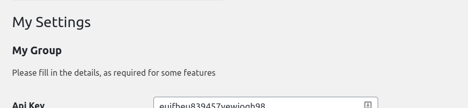
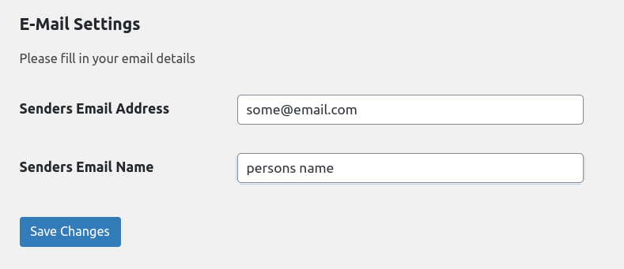

# Settings Group

When creating custom settings pages, you can add multiple Settings\_Groups to your page. You can add as many sections as you need and with the help of the before and after form fields, can even be made into tabs.

### create\(\)

> @param string $group\_key   The unique key for this group.  
> @param string $group\_label The groups label  
> @param string $page\_slug The slug from the page settings to be used.  
> @return \PinkCrab\Modules\Settings\_Page\Settings\_Group

Just acts as a static wrapper for the constructor. Makes doing fluent chains a little cleaner.

```php
$group = new Settings_Group('my_group', 'My Group', 'my_settings_page');
// OR 
$group = Settings_Group::create('my_group', 'My Group', 'my_settings_page');
```

### description\(\)

> @param string $description   Sets the optional description.  
> @return \PinkCrab\Modules\Settings\_Page\Settings\_Group

Will be shown below the group title on the settings page.   
_**OPTIONAL**_

```php
$group = Settings_Group::create('my_group', 'My Group', 'my_settings_page')
    ->descripion('Please fill in the details, as required for some features');
```



### add\_field\(\)

> @param \PinkCrab\Modules\Settings\_Page\Settings\_Field $field  
> @return \PinkCrab\Modules\Settings\_Page\Settings\_Group

Multiple fields can be added to a group. Each must be a populate instance of **Settings\_Field** object. Each field is used to register, display, and process the settings fields. 

```php
// Create a simple text input for the field. (See Form_Field for more details)
$input = Input_Text::create( 'ache_api_key', 'Api Key' );

// Generate field using input with simple sanitization.
$field = Settings_Field::from_field($input);
$field ->santization_callback( 'sanitize_text_field' );

// Create group and add field.
$group = Settings_Group::create('my_group', 'My Group', 'my_settings_page');
$group->add_field($field);
```

Multiple **Settings\_Field's** can be added to any group, each can be configured to ensure the WP\_Settings api acts as expected.

Examples

This is example shows the creation of a simple 2 field api settings page. _Some of the **My\_Settings** class properties are missing, to highlight the settings group._

```php
use PinkCrab\Modules\Settings_Page\Settings_Page;
use PinkCrab\Modules\Settings_Page\Settings_Field;
use PinkCrab\Modules\Settings_Page\Settings_Group;
use PinkCrab\Modules\Form_Fields\Fields\Input_Text;

class My_Settings extends Settings_Page {
	
	// Use this method to add your groups.	
	protected function add_settings( Settings_Collection $settings ): void {
		$settings->add( $this->my_settings_group() );
	}
		
	// Returns our populated group
	protected function api_settings_group(): Settings_Group {
		$group = Settings_Group::create(
			'achme_email_settings', // Group Key
			'Email Settings', // Group Label
			$this->key // The current page slug
		);
			
		// Deifne the fields. (See Settings Field for more on fields)
		$email_input = Input_Text::create( 'ache_email_senders_email', 'Senders Email Address' );
		$senders_email_field = Settings_Field::from_field($email_input)
			->type( 'string' )
			->santization_callback( 'sanitize_email' );
		
		$name_field = Input_Text::create( 'ache_email_senders_name', 'Senders Email Name' );
		$senders_email_name = Settings_Field::from_field($name_field)
			->type( 'string' )
			->santization_callback( 'sanitize_text_field' );
			
		// Set the fields and description.
		$group->description( '<p>Please fill in your email details</p>' );
		$group->add_field( $senders_email_field );
		$group->add_field( $senders_email_name );
		
		return $group;
	}
}
```



This can also be written a little more compactly, by chaining most of the setup.

```php
// Deifne the fields.
$senders_email_field = Settings_Field::from_field(
	Input_Text::create( 'ache_email_senders_email', 'Senders Email Address' )
)->type( 'string' )->santization_callback( 'sanitize_email' );

$senders_email_name = Settings_Field::from_field(
	Input_Text::create( 'ache_email_senders_name', 'Senders Email Name' )
)->type( 'string' )->santization_callback( 'sanitize_text_field' );

// Create group.
$group = Settings_Group::create(
	'achme_email_settings',
	'E-Mail Settings',
	$this->key
);

// Set description and fields.
$group->description( '<p>Please fill in your email details</p>' );
$group->add_field( $senders_email_field );
$group->add_field( $senders_email_name );
```

