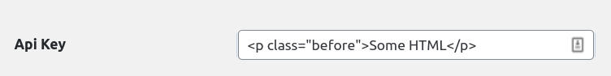
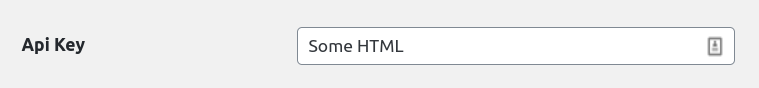

# Settings\_Field

There are two ways to create a field, from the constructor or by using an _\(PinkCrab Form\_Fields\)_ Input field. 

### from\_field\(\)

> @param \PinkCrab\Modules\Form\_Fields\Fields\Abstract\_Field $field   
> @return \PinkCrab\Modules\Settings\_Page\Settings\_Field

When created using a **Form\_Field**, the key is taken from the **Form\_Field** and set to the _Settings\_Field_

```php
$field = Settings_Field::from_field(
    Input_Text::create( 'input_key', 'Field Label' )
        ->placeholder( 'Please dont forget to fill me in!' )
);
```

### input\_field\(\)

> @param \PinkCrab\Modules\Form\_Fields\Fields\Abstract\_Field $field   
> @return \PinkCrab\Modules\Settings\_Page\Settings\_Field

A Settings\_Field can be constructed, using the regular constructor. When done this way, a  Form\_Field will need to be added to the setting.

```php
// Create input field.
$input = Input_Text::create( 'input_key', 'Field Label' )
    ->placeholder( 'Please dont forget to fill me in!' );

// Create setting and add input field.
$field = new Settings_Field( 'input_key' );
$field->input_field( $input );
```

> Ensure the Input and Settings key match. \(Using from\_field\(\) extracts the key from the input field\)

### set\_current\_input\_value\(\)

> @param mixed $value   
> @return \PinkCrab\Modules\Settings\_Page\Settings\_Field

The current value of the Form\_Field can be set. This allows the pre-population using get\_option\(\)

```php
$field = Settings_Field::from_field(
    Input_Text::create( 'input_key', 'Field Label' )
);

// Set the input with the current settings value.
$field->set_current_input_value( get_option( 'input_key' ) );
```

### type\(\)

> @param string $type   
> @return \PinkCrab\Modules\Settings\_Page\Settings\_Field

The WordPress setting api allows for the storage of various types of data. To ensure they are correctly handled, the type should be defined.

```php
$field = Settings_Field::from_field(
    Input_Text::create( 'input_key', 'Field Label' )
);

$field->type( 'string' );
```

> As with the regular wordpress settings api, the following types are allowed.  
> 'string', 'boolean', 'integer', 'number', 'array' and 'object'

### santization\_callback\(\)

> @param string\|callable $santization\_callback   
> @return \PinkCrab\Modules\Settings\_Page\Settings\_Field

Before the value is added to the database \(in the options table\), it can have a sanitization callback applied. This can be used to either ensure the data is properly escaped or to do any final modifications to arrays or objects.   
A valid callable must be passed, although passing a blank string will ensure the data is stored as-is.

```php
$field = Settings_Field::from_field(
    Input_Text::create( 'api_key', 'Api Key )
);
$field->santization_callback( 'sanitize_text_field' );
```





### show\_in\_rest\(\)

> @param bool\|array $show\_in\_rest   
> @return \PinkCrab\Modules\Settings\_Page\Settings\_Field

The settings field can be accessed via  WP\_Rest. You can use **show\_in\_rest\(\)** to define more complex schemas if storing objects or arrays, or just to block/allow its access.

By default it is set to true, setting to false will make the setting unaccessible, and passing an array allows for a custom schema.

```php
$field->show_in_rest([
    'name' => 'images_slide',
    'schema' => array(
       'type'  => 'array',
       'items' => array(
           'id'    => 'string',
            'order' => 'string',
       ),
    )
]);
```

## General Getters

### get\_option\_key\(\)

> @return string

Returns the set field key/slug

### get\_santization\_callback\(\)

> @return string\|callable

Returns the defined callable

### get\_type\(\)

> @return string

Returns the defined type.

### get\_show\_in\_rest\(\)

> @return bool\|array

Returns the defined rest rules.

### get\_input\_field\(\)

> @return Abstract\_Field

Returns the defined input field

### get\_input\_label\(\)

> @return string

Returns the input fields label/name.

