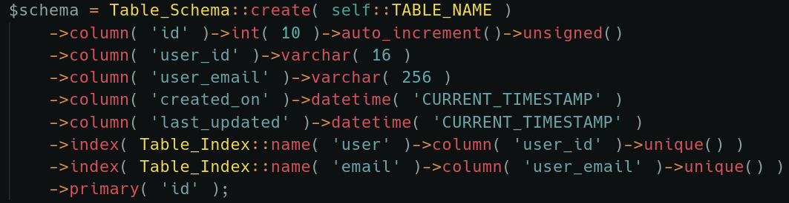

# Table Builder

### **Requires no additional PinkCrab modules.**

**Can be used as a standalone library, as part of any WordPress plugin or theme. Using the interfaces, custom table builders can be used to create MsSql or Postgress drivers.**



[View on GitHub](https://github.com/Pink-Crab/Table-Builder)

### Installation

The **Table\_Builder** module can be installed as either just submodules or using the **Module\_Manager**. Ensure you are in the root of your plugin directory before calling these.

#### As Git Submodule.

This can either be done using a GUI git client such as GitKracken or from the terminal

```bash
# Create Modules directory (Skip if already exists)
$ mkdir Modules

# Install Table_Builder
$ git submodule add https://github.com/Pink-Crab/Table-Builder.git Modules/Table_Builder
```

**Using Module\_Manger**

If you have the **Module\_Manger** installed, modules can be added simply using the module add command.

```bash
$ bash PinkCrab.sh module add table_builder
```

### Location and Namespace

The **Registerables** module must be installed in `Modules/Table_Builder` and uses the `PinkCrab\Modules\Table_Builder` namespace.

