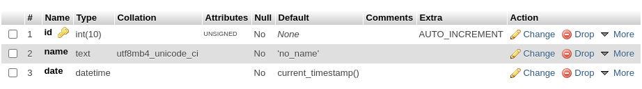
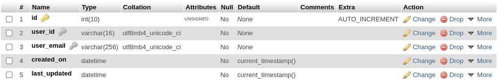
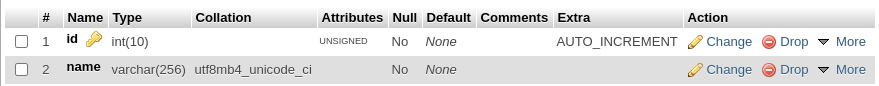
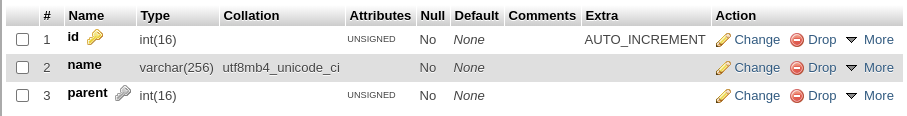
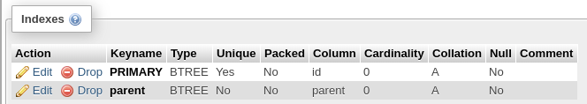
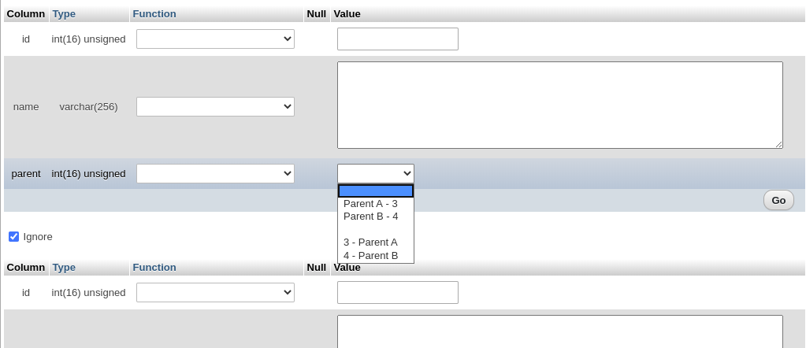

# Examples

### Simple Table

```php
use PinkCrab\Modules\Table_Builder\Table_Schema;
use PinkCrab\Modules\Table_Builder\Builders\DB_Delta;

// Define the table (Indvidual method calls)
$table = Table_Schema::create( 'simple_table' );

// Columns
$table->column( 'id' )->int(10)->auto_increment()->unsigned();
$table->column( 'name' )->text()->default( 'no_name' );	
$table->column( 'date' )->datetime( 'CURRENT_TIMESTAMP' );

// Set a primary key.
$table->primary( 'id' );	

			
// Construct builder.
global $wpdb;
$builder = new DB_Delta($wpdb); 

// $builder = App::make(DB_Delta::class); 
// Can be used if using the PinkCrab Framework

// Build table.
$table->create_table($builder);
```



### Simple Table with Unique Indexes

Using the TableIndex class, you can define if a column is unique, full\_text and even using hashing if enabled with mysql.

All users are unique, without any duplicated emails or user ids. The 2 are set as named, indexes

```php
use PinkCrab\Modules\Table_Builder\Table_Index;
use PinkCrab\Modules\Table_Builder\Table_Schema;
use PinkCrab\Modules\Table_Builder\Builders\DB_Delta;

// Define the table (Chained)
$table = Table_Schema::create( 'unique_users' )			
	->column( 'id' )->int( 10 )->auto_increment()->unsigned()			
	->column( 'user_id' )->varchar( 16 )			
	->column( 'user_email' )->varchar( 256 )			
	->column( 'created_on' )->datetime( 'CURRENT_TIMESTAMP')
	->column( 'last_updated' )->datetime('CURRENT_TIMESTAMP')
	->index( Table_Index::name( 'user' )->column( 'user_id' )->unique()	)			
	->index( Table_Index::name( 'email' )->column( 'user_email' )->unique() );
			
// Construct builder.
global $wpdb;
$builder = new DB_Delta($wpdb); 

// Build table.
$table->create_table($builder);
```




### Parent with Children References.

hi\_ __yr\_2     y\_2 y2\_c    f\_2   g_3   g_r

We can create cross-referenced Parent/Child indexes. This is fairly limited to this example and the simpler indexes above but is more than suitable for the majority of WordPress Plugins and Themes. 

```php
use PinkCrab\Modules\Table_Builder\Table_Index;
use PinkCrab\Modules\Table_Builder\Table_Schema;
use PinkCrab\Modules\Table_Builder\Builders\DB_Delta;

// Define the table (Chained)
$parent_table = Table_Schema::create( 'parent_table' )			
	->column( 'id' )->int( 10 )->auto_increment()->unsigned()			
	->column( 'name' )->varchar( 128 )			
	
$child_table = Table_Schema::create( 'child_table' )	
	->column( 'id' )->int( 16 )->auto_increment()->unsigned()
	->column( 'name' )->varchar( 256 )
	->column( 'parent' )->int( 16 )->unsigned()
	->primary( 'id' )
	->index(
		Table_Index::name( 'parent' )
			->column( 'parent' )
			->foreign_key()
			->reference_table( 'parent_table' )
			->reference_column( 'id' )
			->on_delete( 'CASCADE' )
	);
			
// Construct builder.
global $wpdb;
$builder = new DB_Delta($wpdb); 

// Build tables.
$parent_table->create_table($builder);
$child_table->create_table($builder);
```









